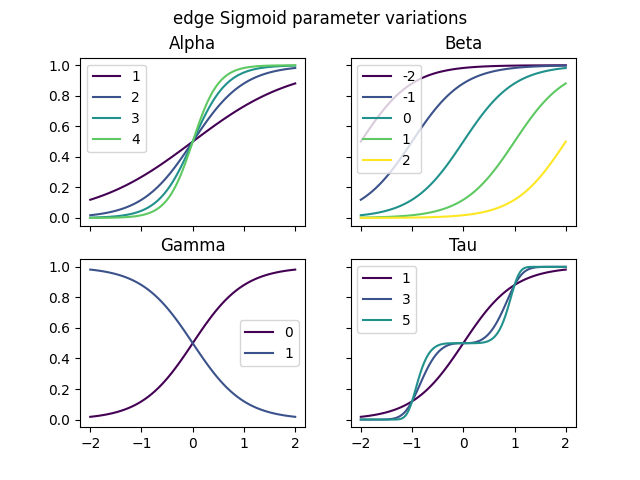
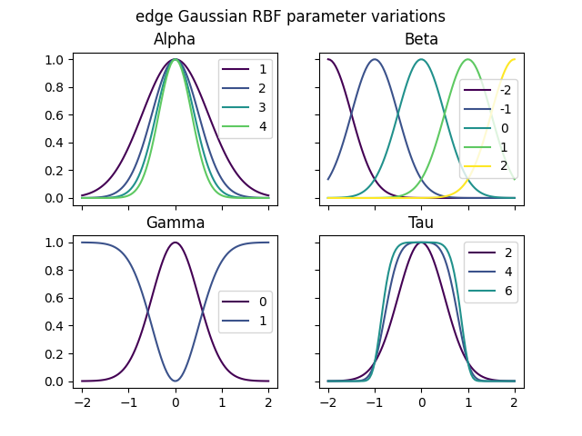
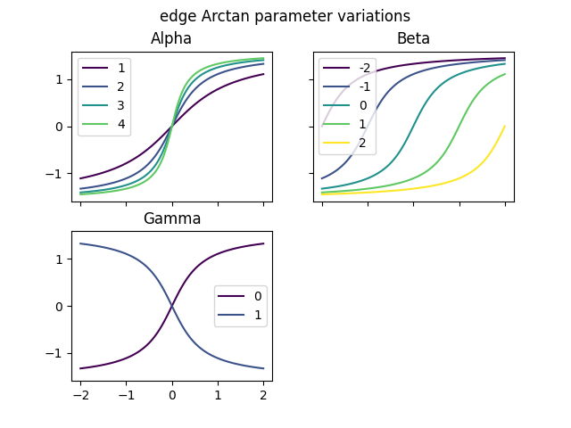

.. _function_list:

=====================================
Available Functions and Distributions
=====================================

.. _available_output_distributions:

Output Distributions
====================

The distributions are provided by `Scipy's` `stats <https://docs.scipy.org/doc/scipy/reference/stats.html>`_ module. Instead of calling the ``.rvs()`` method, however, we use the ``.ppf()`` (percent point function) method to obtain realizations given the error terms.

For the parameters with described *range*, we can specify correction.

.. list-table::
   :widths: 20 60 20
   :header-rows: 1

   * - Distribution
     - Parameters
     - Range
   * - ``bernoulli``
     - ``p_``: success probability
     - :math:`[0, 1]`
   * - ``uniform``
     - ``mu_``: center point: `(a+b)/2`
     - :math:`\mathbb{R}`
   * -
     - ``diff_``: range: `b-a`
     - :math:`\mathbb{R}`
   * - ``normal``
     - ``mu_``: mean
     - :math:`\mathbb{R}`
   * -
     - ``sigma_``: standard deviation
     - :math:`\mathbb{R}_+`
   * - ``lognormal``
     - ``mu_``: mean
     - :math:`\mathbb{R}`
   * -
     - ``sigma_``: standard deviation
     - :math:`\mathbb{R}_+`
   * - ``poisson``
     - ``lambda_``: rate
     - :math:`\mathbb{N}_0`
   * - ``Exponential``
     - ``lambda_``: rate
     - :math:`\mathbb{R}_+`

.. _available_edge_functions:

Edge Functions
==============

Read more about each edge function by clicking the link in the table title.

.. _edge_identity:

Identity
--------

Formula
~~~~~~~

.. math::
    {z^{*}}_i = z_i

PARCS Code
~~~~~~~~~~

.. literalinclude:: ../../../pyparcs/api/mapping_functions.py
    :caption: ``pyparcs.api.mapping_functions.py``
    :lines: 34-36
    :linenos:

Parameters
~~~~~~~~~~

``identity()`` edge function has no parameters.

------------------

Sigmoid
-------

Formula
~~~~~~~

.. math::
    z^*_i = \sigma\left(
        (-1)^{\gamma} \alpha (z_i - \beta)^{\tau}
    \right), \quad \sigma(a) = \frac{1}{1+e^{-a}}

PARCS Code
~~~~~~~~~~

.. literalinclude:: ../../../pyparcs/api/mapping_functions.py
    :caption: ``pyparcs.api.mapping_functions.py``
    :lines: 40-49
    :linenos:
    :emphasize-lines: 9, 10

Parameters
~~~~~~~~~~

.. list-table:: ``sigmoid()`` parameters
   :widths: 20 60 20
   :header-rows: 1

   * - Parameter
     - Description
     - Default
   * - :math:`\alpha`: ``alpha``
     - | Scale of the Sigmoid. Takes positive values.
       | The reasonable range is approx. :math:`[1, 3]`.
     - ``2``
   * - :math:`\beta`: ``beta``
     - | Offset of the Sigmoid. Takes real values.
       | The reasonable range is approx. :math:`[-2, 2]`.
     - ``0``
   * - :math:`\gamma`: ``gamma``
     - Mirroring on x-axis. Takes :math:`\{0, 1\}`.
     - ``0``
   * - :math:`\tau`: ``tau``
     - | Induces a dwelling region in the center of the function.
       | Takes odd values :math:`\{1, 3, \dots\}`.
     - ``1``

The figures below depict the effect of each parameter on the sigmoid transformation:

------------------

Gaussian RBF
------------

Formula
~~~~~~~

.. math::
        \begin{align}
            z^*_i = \gamma + (-1)^\gamma .
            \exp\big(-\alpha \|z_i - \beta\|^\tau\big),
        \end{align}

PARCS Code
~~~~~~~~~~

.. literalinclude:: ../../../pyparcs/api/mapping_functions.py
    :caption: ``pyparcs.api.mapping_functions.py``
    :lines: 53-62
    :linenos:
    :emphasize-lines: 9, 10

Parameters
~~~~~~~~~~

.. list-table:: ``gaussian_rbf()`` parameters
   :widths: 20 60 20
   :header-rows: 1

   * - Parameter
     - Description
     - Default
   * - :math:`\alpha`: ``alpha``
     - | Scale of the RBF. Takes positive values.
       | The reasonable range is approx. :math:`[1, 3]`.
     - ``2``
   * - :math:`\beta`: ``beta``
     - | Offset of the RBF. Takes real values.
       | The reasonable range is approx. :math:`[-2, 2]`.
     - ``0``
   * - :math:`\gamma`: ``gamma``
     - Mirroring on y-axis. Takes :math:`\{0, 1\}`.
     - ``0``
   * - :math:`\tau`: ``tau``
     - | Induces a dwelling region in the center of the function.
       | Takes even values :math:`\{2, 4, \dots\}`.
     - ``2``

The figures below depict the effect of each parameter on the Gaussian RBF transformation:

------------------

Arctan
------

Formula
~~~~~~~

.. math::
    \begin{align}
        z^*_i = (-1)^{\gamma} .
        \arctan{(\alpha(z_i-\beta))},
    \end{align}

PARCS Code
~~~~~~~~~~

.. literalinclude:: ../../../pyparcs/api/mapping_functions.py
    :caption: ``pyparcs.api.mapping_functions.py``
    :lines: 66-73
    :linenos:
    :emphasize-lines: 8

Parameters
~~~~~~~~~~

.. list-table:: :func:`~pyparcs.cdag.mapping_functions.edge_arctan`
   :widths: 20 60 20
   :header-rows: 1

   * - Parameter
     - Description
     - Default
   * - :math:`\alpha`: ``alpha``
     - | Scale of the RBF. Takes positive values.
       | The reasonable range is approx. :math:`[1, 3]`
     - ``2``
   * - :math:`\beta`: ``beta``
     - | Offset of the RBF. Takes real values.
       | The reasonable range is approx. :math:`[-2, 2]`
     - ``0``
   * - :math:`\gamma`: ``gamma``
     - Mirroring on y-axis. Takes :math:`\{0, 1\}`
     - ``0``

The figures below depict the effect of each parameter on the arctan transformation:

.. _corrections:

Corrections
===========

.. _sigmoid_correction:

Sigmoid Correction
------------------

.. list-table:: :func:`~pyparcs.cdag.utils.SigmoidCorrection`
   :widths: 10 70 10 10
   :header-rows: 1

   * - Parameter
     - Description
     - type
     - default (yml/py)
   * - ``lower, upper``
     - Lower and upper range of the corrected values.
     - `float`
     - `0, 1`
   * - ``to_center``
     - | If the raw values must be centered (mean = 0)
       | before sigmoid correction.
     - `bool`
     - `false/False`
   * - ``target_mean``
     - | Specify this option if you want to fix the mean
       | of corrected values. Must be in range of (lower, upper)
     - *float*
     - `null/None`

Edge Correction
------------------

.. list-table:: :func:`~pyparcs.cdag.utils.EdgeCorrection`
   :widths: 10 70 10 10
   :header-rows: 1

   * - Parameter
     - Description
     - type
     - default (yml/py)
   * -
     -
     -
     -
