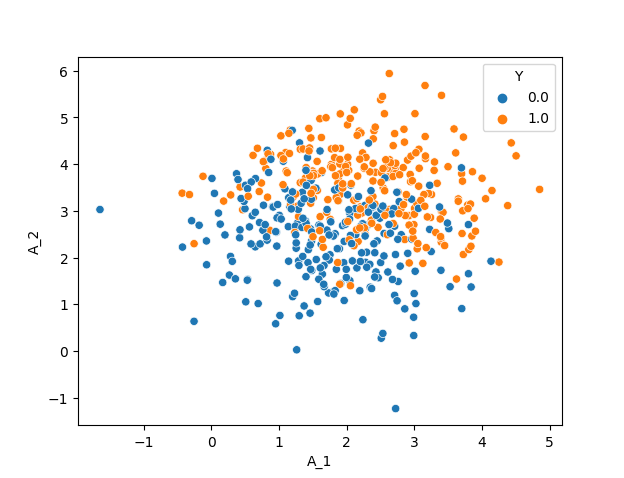
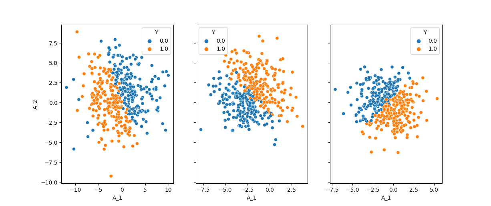

.. _partial_randomization:

Partial Randomization
=====================

So far, we have learned how to specify a causal graph for simulation and sample from that to synthesize a dataset. The question is what does it take to specify a graph? The answer is, every detail of that graph, down to the last coefficient of each equation. As soon as we do not specify a parameter or a coefficient, the whole process stops.

Next question is, how do we know the *known* parts of the graph? It is by some prior knowledge that we specifically specify those parts. For instance, we know about an *Age* variable that follows a normal distribution with known mean and standard deviation, and that it doesn't have a parent within the simulation variables. From the evaluation point of view, the known parts are specified by the *assumptions* of the to-be-tested model: If you claim that your model performs well in linear settings, this is the aspect we know about the simulation study which is suitable for evaluating your model; all the rest (e.g. number of variables) shall not be fixed, or we have restricted the testing space of the model to somewhat more restricted than the promised space.

Finally, what to do when we hold partial information about a simulation setting? The answer is, we sample from a *graph* space of all possible simulation mechanisms that comply with our given information, yet vary across the undefined parts. As the **PA-rtially R-andomized** part of the PARCS name indicates, it provides a solution, compatible with the graph simulation workspace, for resolving this issue.

Imagine we want to simulate a scenario with two normally distributed (treatment) and one Bernoulli (outcome) random variables. Our goal is to test and empirically evaluate an algorithm that claims to estimate the causal effect of each treatment on the outcome when the treatments are independent, and the causal relations are linear.

Given this information:

#. The two treatment must have no edge, while both will have an edge to the outcome.
#. Only the identity edge function, and linear terms for the parameters are allowed.

One possible outline for such a scenario is:

.. code-block:: yaml

    A_1: normal(mu_=2, sigma_=1)
    A_2: normal(mu_=3, sigma_=1)
    Y: bernoulli(p_=A_1+2A_2), correction[]
    # infer edges

The resulting dataset with 500 datapoints is:

But this is only one out of many complying simulation settings for your problem.

.. _randomize_connection:

Randomizing the Parameters
--------------------------

Now let's have a look at the following outline:

.. code-block:: yaml

    A_1: normal(mu_=?, sigma_=?)
    A_2: normal(mu_=?, sigma_=?)
    Y: bernoulli(p_=?), correction[]
    A_1->Y: identity()
    A_2->Y: identity()

The question marks which has replaced the distributions' parameters tell PARCS that we do not want to fix those parameters. Then PARCS samples from the space of possible parameters and each time, returns one specific graph. But sampling based on what? Based on a randomization *guideline* that we write as another outline:

.. code-block:: yaml

    nodes:
      normal:
        mu_: [ [f-range, -2, 2], 0, 0 ]
        sigma_: [ [f-range, 1, 4], 0, 0]
      bernoulli:
        p_: [ [f-range, -1, 1], [f-range, -5, -3, 3, 5], 0]

In this guideline (which can be a dictionary, similar to graph outlines):

#. The node entry includes information about one normal distribution and one Bernoulli distribution. Each distribution, in return, holds information about their parameters.
#. The value of each parameter key is a list of 3 elements. This corresponds to bias, linear, and interaction factors. These elements are called *directives*, as they describe the search space for the coefficients of these factors.
#. The directives for the linear and interaction factors of ``mu_`` and ``sigma_``, as well as for the interaction factors of ``p_`` is zero, meaning that these coefficients will always be zero when PARCS is sampling the coefficients.
#. The rest of the directives start with ``f-range``. This tells the PARCS to sample a float value from the given range. ``[f-range, -2, 2]`` gives the :math:`[-2, 2]` range, and ``[f-range, -5, -3, 3, 5]`` gives :math:`[-5, 3] \cup [3, 5]`. Other possible directive types are ``i-range`` for sampling from a discrete uniform, and ``choice`` from a list of options that follows. See :ref:`here <conventions_guideline>` for a detailed introduction of the guideline outline.

This outline will then be used to instantiate a ``Guideline`` object and randomize the Description using the ``.randomize_parameters()`` method:

.. literalinclude:: ./code_blocks/partial_randomization/param_randomize_1.py
    :caption: randomizing a partially-specified graph
    :linenos:
    :emphasize-lines: 7-11, 19

Using this method, you can also tell PARCS to randomly select the distributions and edge functions as well. This is done using the ``random`` keyword, when PARCS chooses among the provided distributions and functions in the guideline:

.. literalinclude:: ./code_blocks/partial_randomization/param_randomize_2.py
    :caption: leaving the node distributions to randomization
    :linenos:
    :lines: 5-30
    :emphasize-lines: 11, 12

Randomization Tags
------------------

When we call ``.randomize_parameters()``, all the undefined elements of the outline are specified based on the given guideline. There will be scenarios, however, that you want to use two different guidelines to randomize different sets of coefficients and functions. For instance, you have a Bernoulli distribution with undefined parameters ``bernoulli(p_=?)``, therefore you need to have a Bernoulli entry in the guideline, while you have another random node for which you only want to choose between normal and lognormal distributions; but since Bernoulli must be in the guideline, it will be considered no matter what.

To handle these scenarios, PARCS allows you to *tag* the outline lines, and pass a tag parameter to the randomizing method, so that only the lines having that tag will be randomized.

.. literalinclude:: ./code_blocks/partial_randomization/randomizer_tag.py
    :caption: selective randomization using tags
    :linenos:
    :lines: 5-23
    :emphasize-lines: 11-13, 16, 18

Some remarks:

- The associated tag for a randomization is given as the second argument of the randomization method. Only one tag is allowed. The ``randomize_parameter`` tags must start with ``P``.
- In line 17 and 19, we used a description attributed called ``.is_partial``. This is True whenever the description is not fully specified. You can see that the description is still partially specified after the first randomization, the random nodes are yet to be specified.

.. _connection_randomization_doc:

Connection to a Subgraph
------------------------

Assume the following structural equations model.

.. math::

    \begin{aligned}
        L &= AL \\
        Z &= BZ + CL
    \end{aligned}

where :math:`Z` and :math:`L` are random vectors, :math:`A` and :math:`B` are a lower triangular coefficient matrices, and :math:`C` is another arbitrary coefficient matrix. In this model, :math:`L` and :math:`Z` can be normal simulation graphs, while :math:`Z` receives causal edges from :math:`L` via the :math:`C` matrix.

In PARCS, this setting is interpreted as connecting two descriptions, assuming that the flow of edge is one way from a parent to a child graph. This can be done via another randomization method, the ``.randomize_connection_to()``

.. literalinclude:: ./code_blocks/partial_randomization/randomize_connection.py
    :caption: connecting a graph a child graph
    :linenos:
    :emphasize-lines: 15

In this code:

- Line 15 randomizes a connection from the main description to a child outline. The passed argument in this line is clearly for parsing the child outline (the parent outline has already been parsed)
- In the guideline dict (line 8) there is a graph key, including the information about density. The :math:`[0, 1]` range density directive, determines the sparsity of the connection edges. As we have chosen ``'density':1``, the randomization method makes all the possible edges, as shown in line 21
- In line 24, we have printed the info on Node ``Z_1`` after randomization. The bias term for the node is 0.3, which follows the outline information. You can see, however, that two linear coefficients (for ``Z_1`` and ``Z_2``) are non zero, but the interaction coefficients are. This follows the directives given in the guideline. but more importantly, you can see how ``randomize_connection_to()`` method changes the parameter equations: In an additive fashion, it adds the new terms for the new parents to the existing equation. Thus, a limitation of this method is that no interaction terms will be added among existing and new parents.

In this process, we can prevent certain nodes in the parent description from having out-going edges to the child nodes. This is controlled by using a ``C`` tag, similar to the parameter randomization method (only the lines with the corresponding tags will be invoked):

.. literalinclude:: ./code_blocks/partial_randomization/randomize_connection_2.py
    :caption: using tags, ``L_2`` only has out-going edges
    :linenos:
    :lines: 11-19
    :emphasize-lines: 2, 9

Randomize connection method accepts other arguments to control the randomization process, e.g. to apply a custom mask to the parent-to-child adjacency matrix, or preventing certain parameters from being affected; all these you can find out in detail in the description class :ref:`API doc <description_api_doc>`.

.. _random_description_doc:

A Random Graph from Scratch
---------------------------

What if we want to start with a completely random graph, which still follows the directives of a guideline? This can be done using the ``RandomDescription`` class:

.. literalinclude:: ./code_blocks/partial_randomization/random_description.py
    :caption: A random description from scratch
    :linenos:
    :emphasize-lines: 12

The ``graph`` key in the guidelines plays the main role in this instantiation. The ``num_nodes`` and ``density`` parameters specify the general specifications of the graph. When the nodes and edges are spawned, the distributions, functions and parameters will be randomized as before.
